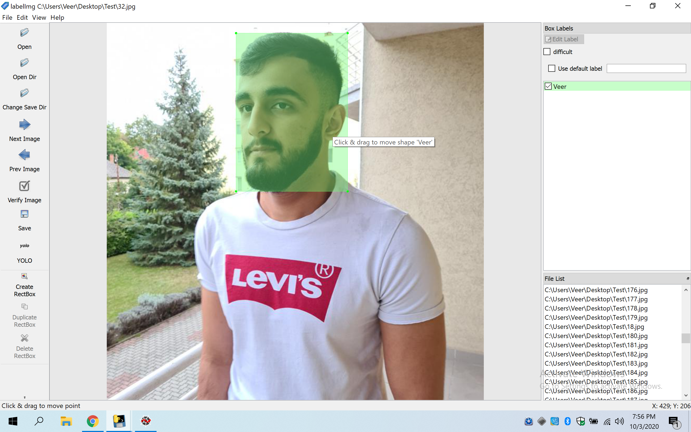

# Custom Object Detection with TensorFlow-2

These are the steps i took to train an Object Detection model to detect my face. I used TensorFlow 2 Object Detection API on Windows 10. I used a virtual machine on Microsoft Azure. My VM was Standard DS2 v2, with 2 virtual CPUs and 7 GB of memory.
This reposity acts as a guide for others and also as a reference for myself to look back at.

In this project i will use the SSD MobileNet V2 FPNLite 640x640 pretrained model as it runs on low power devices like the raspberry pi and doesnt have too much of an accuracy hit. Others models with higher accuracy are better for projects where we use more powerful hardware, since i want to port this model to a raspberry pi 4, i stuck with this model. [Other models](https://github.com/tensorflow/models/blob/master/research/object_detection/g3doc/tf2_detection_zoo.md)

## Softwares needed
- [Python](https://www.python.org/downloads/windows/) [enable long paths in the setup]
- [git](https://git-scm.com/downloads)
- [Anaconda](https://www.anaconda.com/products/individual) [set this as PATH in the setup]
- [Visual Studio 2019 with C++ Build Tools](https://visualstudio.microsoft.com/thank-you-downloading-visual-studio/?sku=Community&rel=16)
- [Visual C++ 2015 build tools](https://go.microsoft.com/fwlink/?LinkId=691126)
- [LabelImg](https://tzutalin.github.io/labelImg/)
- [7Zip](https://www.7-zip.org/download.html)

## Installing TensorFlow CPU
Open the anaconda command prompt. Create a virtual environment
```
conda create -n tensorflow pip python=3.8
```
Then activate the environment with

```
conda activate tensorflow
```
**NOTE: The virtual environment has to be activated each time the anaconda terminal is closed.**
Installing TensorFlow CPU
```
pip install tensorflow
```
Sanity Check
```
python
>>> import tensorflow as tf
>>> print(tf.__version__)
>>> exit()
```
A version number should be displayed.

### Preparing the Workspace
Create a folder directly in C: and name it "TensorFlow". It can be created anywhere but the commands need to be changed accordingly.

```
cd C:\TensorFlow
```
Clone the [TensorFlow models repository](https://github.com/tensorflow/models) with

```
git clone https://github.com/tensorflow/models.git
```
This should clone all the files in a directory called models. After this stay inside C:\TensorFlow and download [this](https://github.com/Purefekt/Custom-Object-Detection-with-TensorFlow-2) repository into a .zip file. Then extract the two files, **workspace**, **scripts** and **other scripts**, directly in to the TensorFlow directory.
<p align="left">
  
</p>

Installing the prequisites for the Object Detection API.

```
conda install -c anaconda protobuf
```
```
cd models\research
```
```
protoc object_detection\protos\*.proto --python_out=.
```
Close the terminal and open a new Anaconda prompt. Use the following command to activate it
```
conda activate tensorflow
```
```
pip install cython
pip install git+https://github.com/philferriere/cocoapi.git#subdirectory=PythonAPI
```
```
cd C:\TensorFlow\models\research
```
```
copy object_detection\packages\tf2\setup.py .
python -m pip install .
```
If there are no errors, run this command
```
python object_detection\builders\model_builder_tf2_test.py
```
Output should be similar to this
```
[       OK ] ModelBuilderTF2Test.test_create_ssd_models_from_config
[ RUN      ] ModelBuilderTF2Test.test_invalid_faster_rcnn_batchnorm_update
[       OK ] ModelBuilderTF2Test.test_invalid_faster_rcnn_batchnorm_update
[ RUN      ] ModelBuilderTF2Test.test_invalid_first_stage_nms_iou_threshold
[       OK ] ModelBuilderTF2Test.test_invalid_first_stage_nms_iou_threshold
[ RUN      ] ModelBuilderTF2Test.test_invalid_model_config_proto
[       OK ] ModelBuilderTF2Test.test_invalid_model_config_proto
[ RUN      ] ModelBuilderTF2Test.test_invalid_second_stage_batch_size
[       OK ] ModelBuilderTF2Test.test_invalid_second_stage_batch_size
[ RUN      ] ModelBuilderTF2Test.test_session
[  SKIPPED ] ModelBuilderTF2Test.test_session
[ RUN      ] ModelBuilderTF2Test.test_unknown_faster_rcnn_feature_extractor
[       OK ] ModelBuilderTF2Test.test_unknown_faster_rcnn_feature_extractor
[ RUN      ] ModelBuilderTF2Test.test_unknown_meta_architecture
[       OK ] ModelBuilderTF2Test.test_unknown_meta_architecture
[ RUN      ] ModelBuilderTF2Test.test_unknown_ssd_feature_extractor
[       OK ] ModelBuilderTF2Test.test_unknown_ssd_feature_extractor
----------------------------------------------------------------------
Ran 20 tests in 45.304s

OK (skipped=1)
```

### Gathering and Labeling the Dataset
- ```annotations```: This is where we will store all our training data needed for our model. The CSV and RECORD files needed for the training pipeline. There is also a PBTXT File with the labels for my custom model.
- ```exported-models```: This is the folder where the exported inference graph is stored.
- ```images```: This folder consists of a test and train folder. Here the dataset images are stored with their label files (XML format).
- ```models```: In this folder we will store our training pipeline and checkpoint information from the training job as well as the CONFIG file needed for training.
- ```pre-trained-models```: Here we will store the pre-trained model that we will use as a starting checkpoint for training
- The rest of the scripts are just used for training and exporting the model.
- I clicked 1,400 images of myself (700 with glasses and 700 without glasses), in different outfits and different angles. I used the **name_changer.py** script to change the name of the images in an ordered manner to keep a track of the data.
- Then i used the **downscale_to_720p.py** script to downscale all the 4k images to 720p. This converted all images from roughly 2-3 MB each to just 60-70 KB each.
- Then i used **mirror_image.py** script to get a mirror image of all 1,400 (720p) images. This made my dataset twice as big. Now i had a total of 2,800 images.
- Finally i used the **RandomNames.bat** to rename all images to random names and then used the **name_changer.py** script again on this folder. This renamed the randomised names from 1-2,800.
- After performing these steps i had 2,800; 720p images in a random order with names from 1-2,800. I copied 20% (560) images to the test folder and 80% (2,240) images to the train folder.
- To label the dataset i used LabelImg directly on the test and train images and labeled each image.
<p align="left">
  
</p>

### Generating Training Data
- Now that the images and XML files are ready, i created the label_map. It is located in **workspace/training_demo/annotations/**. Since this model only detects my face, the number of classes is just one, thus it looks like this.
```
item {
    id: 1
    name: 'Veer'
}
```
- Now i generated the RECORD files for training.
```
pip install pandas
```
Navigate to the scripts\preprocessing directory 
```
cd C:\TensorFlow\scripts\preprocessing
```
Running these 2 commands will generate the RECORD files.
```
python generate_tfrecord.py -x C:\Tensorflow\workspace\training_demo\images\train -l C:\Tensorflow\workspace\training_demo\annotations\label_map.pbtxt -o C:\Tensorflow\workspace\training_demo\annotations\train.record

python generate_tfrecord.py -x C:\Tensorflow\workspace\training_demo\images\test -l C:\Tensorflow\workspace\training_demo\annotations\label_map.pbtxt -o C:\Tensorflow\workspace\training_demo\annotations\test.record
```
- Now under ```annotations``` there should be a ```test.record``` and ```train.record```.

### Configuring the Training Pipeline
- I used the CONFIG File from one of the TensorFlow pre-trained models. There are plenty of models in the [TensorFlow Model Zoo](https://github.com/tensorflow/models/blob/master/research/object_detection/g3doc/tf2_detection_zoo.md), but i used the [SSD MobileNet V2 FPNLite 640x640](http://download.tensorflow.org/models/object_detection/tf2/20200711/ssd_mobilenet_v2_fpnlite_640x640_coco17_tpu-8.tar.gz). After downloading i used 7zip to extract the contents and copied it to the ```pre-trained-models``` directory.
- To store the training pipeline i created a directory called ```my_ssd_mobilenet_v2_fpnlite``` in the ```models``` directory. Then copied the  ```pipeline.config``` from the pre-trained-model.
- I made the following changes to the pipeline.config file 
- Line 3. Change ```num_classes``` to  ```num_classes: 1```
- Line 135. Change ```batch_size``` according to available memory (Higher values require more memory and vice-versa). I changed it to: ```batch_size: 5```
- Line 165. Change ```fine_tune_checkpoint``` to: ```fine_tune_checkpoint: "pre-trained-models/ssd_mobilenet_v2_fpnlite_640x640_coco17_tpu-8/checkpoint/ckpt-0"```
- Line 171. Change ```fine_tune_checkpoint_type``` to: ```fine_tune_checkpoint_type: "detection"```
- Line 175. Change ```label_map_path``` to: ```label_map_path: "annotations/label_map.pbtxt"```
- Line 177. Change ```input_path``` to: ```input_path: "annotations/train.record"```
- Line 185. Change ```label_map_path``` to: ```label_map_path: "annotations/label_map.pbtxt"```
- Line 189. Change ```input_path``` to: ```input_path: "annotations/test.record"```

### Training the Model
Finally i was ready to start the training process. After opening a new anaconda terminal
```
cd C:\TensorFlow\workspace\training_demo
```
```
python model_main_tf2.py --model_dir=models\my_ssd_mobilenet_v2_fpnlite --pipeline_config_path=models\my_ssd_mobilenet_v2_fpnlite\pipeline.config
```
After a few warnings, there should be the first 100 step summary
```
INFO:tensorflow:Step 100 per-step time 16.640s loss=0.454
I0810 11:56:12.520163 11172 model_lib_v2.py:644] Step 100 per-step time 16.640s loss=0.454
```
I ran the model for ~20,700 steps, which took around 95 hours. Since i could only get the cpu only VM i was not able to take advantage of TensorFlow GPU which would've brought my training time significantly down. I was trying to get a loss below 0.150, as this prevents underfitting and overfitting. Tensorflow logs the loss every 100 steps and Ctrl+C can be used to pause the training.


